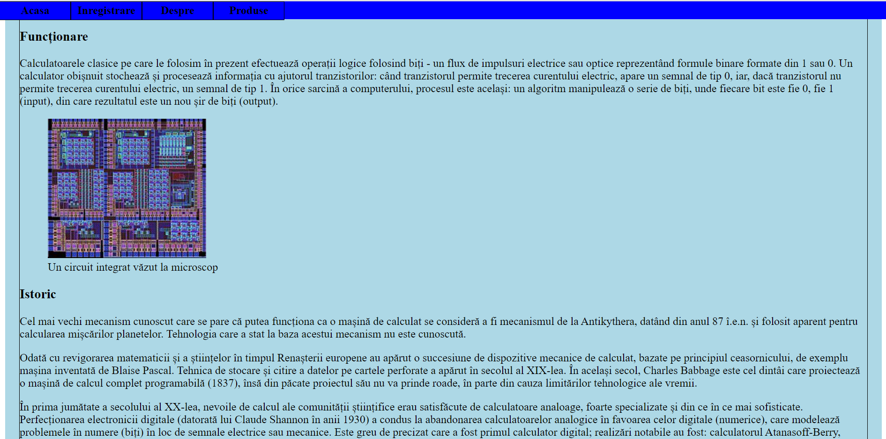

1. Proiectul este un magazin de componente de calculatore, realizatt pentru cursul de Tehinici Web.

2. Proiectul este realizat in HTML, CSS, JavaScript, Node.js si Postgres.

3. Pentru a rula proiectul, trebuie sa aveti instalat Node.js si Postgres.

4. Pentru a rula instala dependentele, trebuie sa rulati comanda `npm install` in directorul proiectului.

5. Pentru a rula proiectul, trebuie sa rulati comanda `node app.js` in directorul proiectului.

